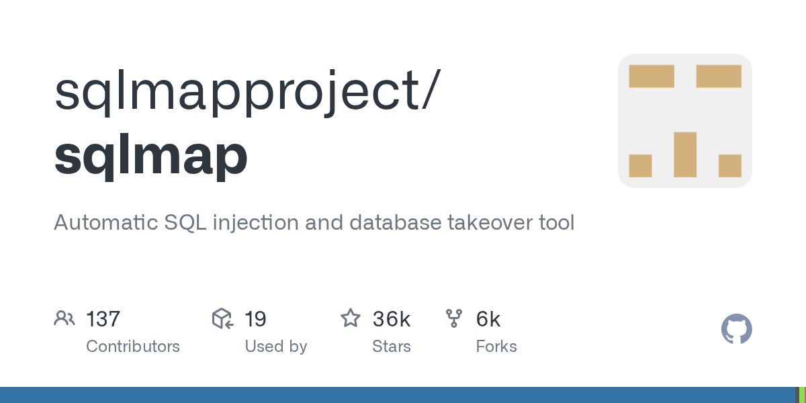
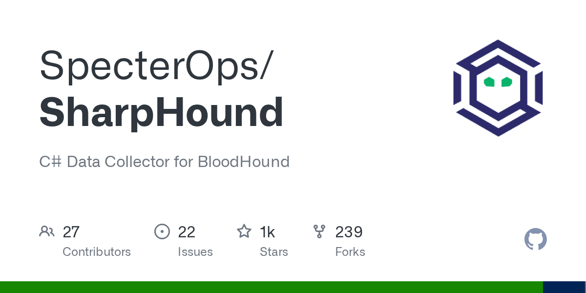
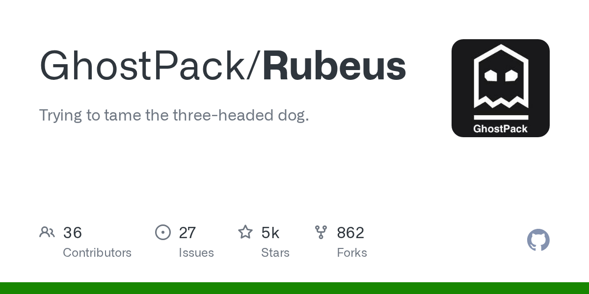
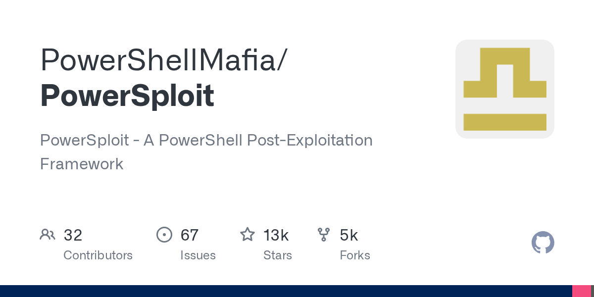

# Core Tooling

## Offensive Security
| | | | | | |
|--|--|--|--|--|--|
|  |  |  |  |  |  |

---

## Identity & Active Directory
| | | | |
|--|--|--|--|
|  |  |  |  |

---

## Exploit Development & Reverse Engineering
| | | | |
|--|--|--|--|
|  |  |  |  |

---

## Operating Systems
| | | | | |
|--|--|--|--|--|
|  |  |  |  |  |

---

## Programming Languages
| | | | | | |
|--|--|--|--|--|--|
|  |  |  |  |  |  |

---

## Scripting & Automation
| | | | |
|--|--|--|--|
|  |  |  |  |

---

## CI/CD & Supply Chain
| | | |
|--|--|--|
|  |  |  |

---

## Web & App Stack
| | | | | | |
|--|--|--|--|--|--|
|  |  |  |  |  |  |

---

## Cloud & Infrastructure
| | | | | | | |
|--|--|--|--|--|--|--|
|  |  |  |  |  |  |  |

---

## Cloud Security
| | | |
|--|--|--|
|  |  |  |

---

## Networking
| | | | | | |
|--|--|--|--|--|--|
|  |  |  |  |  |  |

---

## Observability & DevOps
| | | | |
|--|--|--|--|
|  |  |  |  |

---

## Detection / Defensive Tooling
| | |
|--|--|
|  |  |

---

## Databases
| | | | | | |
|--|--|--|--|--|--|
|  |  |  |  |  |  |
